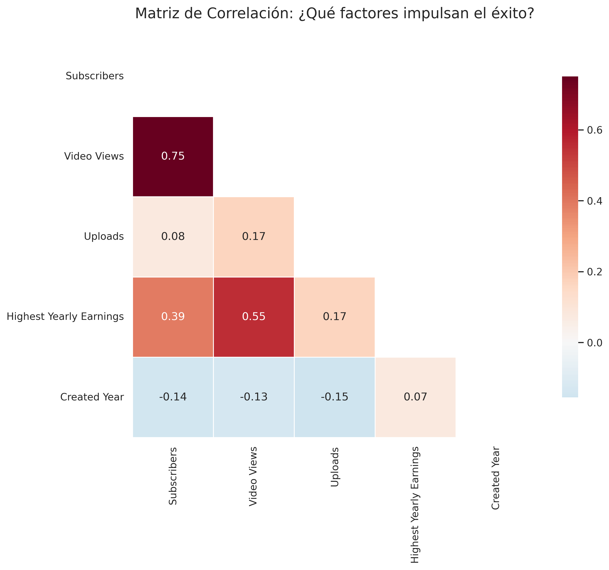
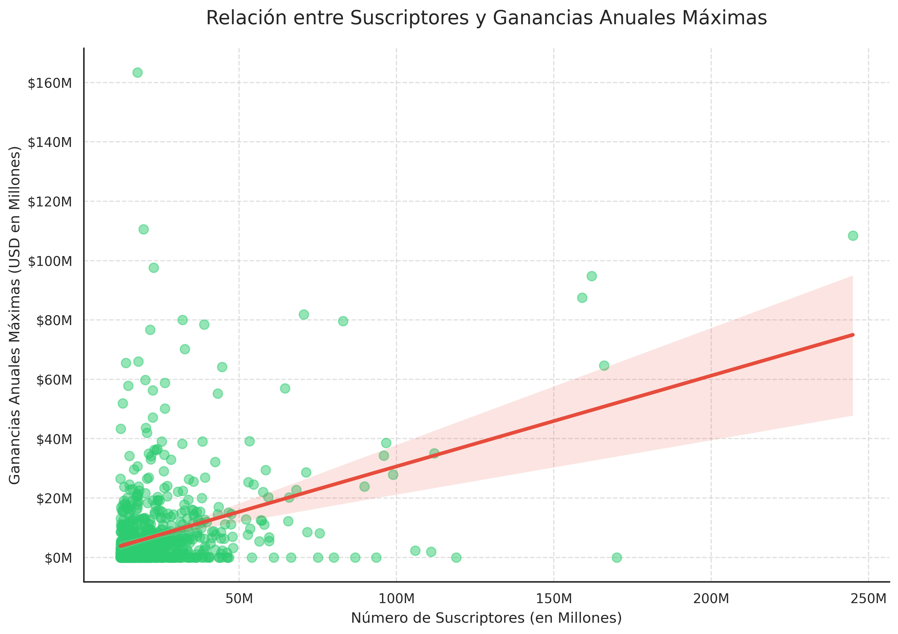

# youtube-analysis
Data analysis on profitability and success factors on YouTube 2023

YouTube Success & Profitability Analysis (2023)

Project Overview

Does having more subscribers automatically guarantee more wealth? In this project, I analyze a dataset of the top 995 YouTube channels to understand the factors that truly drive financial success. Through data cleaning, feature engineering, and statistical visualization, I debunk the relationship between "vanity metrics" and actual earnings.

Tech Stack

- Language: Python
- Libraries: Pandas (Data Manipulation), Seaborn & Matplotlib (Data Visualization), NumPy (Numerical Analysis).
- Environment: Google Colab.

Methodology & Data Cleaning

A high-quality analysis requires clean data. My pipeline included:
- Standardization: Converted all column names to Title Case for better readability.
- Missing Value Imputation: Labeled missing categories and countries as "Unknown" to maintain sample integrity.
- Type Conversion: Formatted temporal and numerical variables (e.g., converting Created Year to integer) to ensure accurate calculations.
- Feature Engineering: Developed a Content Efficiency metric using the formula:

   $$\text{Efficiency} = \frac{\text{Total Video Views}}{\text{Total Uploads}}$$

Key Insights

1. The Subscriber MythData proves that subscribers are not the primary driver of income.The Pearson Correlation Coefficient between subscribers and yearly earnings is only 0.39.This indicates a weak-to-moderate relationship, where only about $15\%$ ($r^2$) of earnings variance is explained by audience size.
2. The "Shows" Category DominanceThe analysis reveals that the Shows category leads in average earnings, with a mean of approximately $25M annually—significantly outperforming traditional categories like Gaming or Vlogs.
3. First-Mover AdvantageThere is a clear negative correlation between channel recency and audience volume. Channels created between 2005 and 2010 maintain a "growth inertia" that gives them a significant edge over newer creators.

Visualizations

- Correlation Heatmap: A visual summary showing that "Video Views" drive earnings far more effectively than "Subscribers".

- Scatter Plot (Audience vs. Wealth): Identification of "Efficiency Outliers"—channels that monetize up to 5x better than global leaders despite smaller audiences.

Conclusion

Success on YouTube is not linear. While subscribers attract brand attention, consistent views and niche authority (such as in 'Autos' or 'Shows') are what build financial empires. This project highlights that efficiency—getting more views per video—is a more sustainable business strategy than simply accumulating subscribers.

How to Run:

1. Clone this repository.
2. Install dependencies: pip install pandas seaborn matplotlib.
3. Open the .ipynb notebook and run the cells sequentially.
